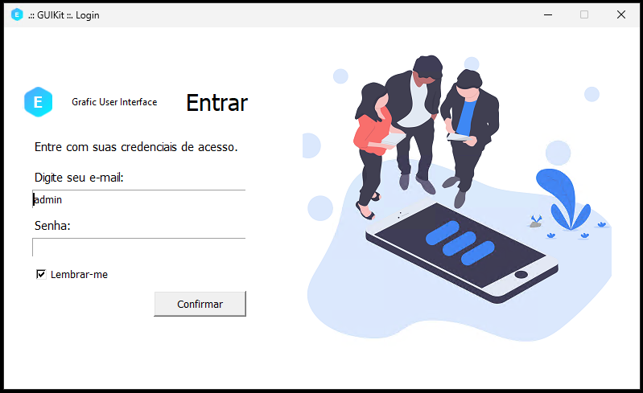
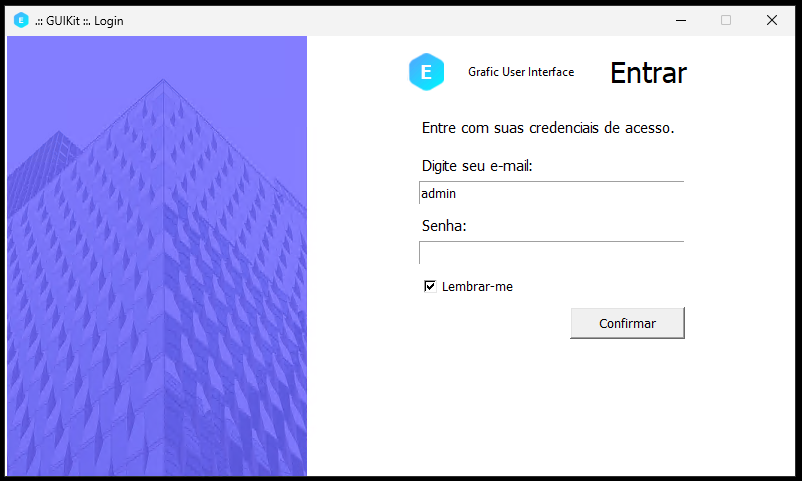
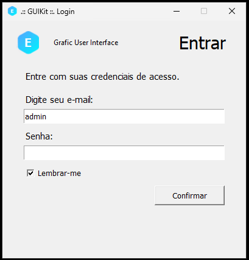
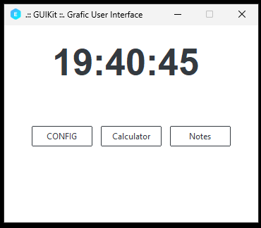
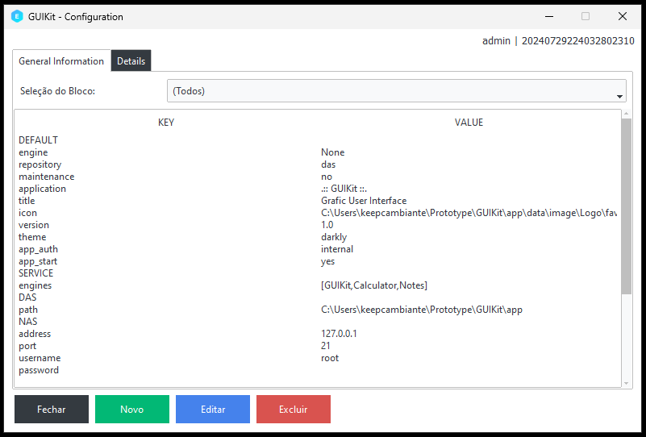
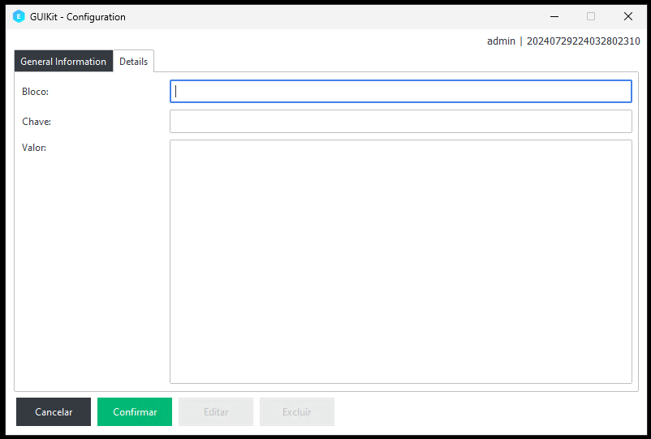
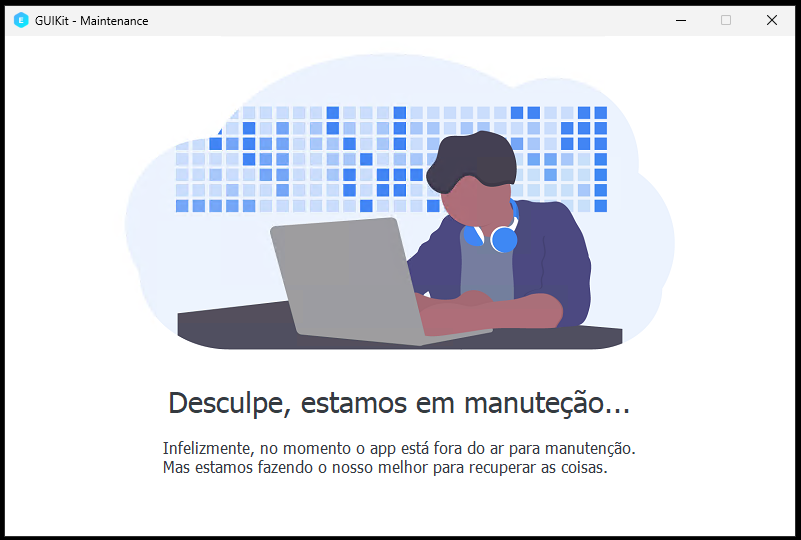

# GUIKit
### Gerenciamento da Aplicação

Protótipo de sistema com recusos básicos para implementar novas funcionalidades.

## Protótipo Modelo de Software – GUIKit
Com a finalidade de apresentar a implementação de uma ou mais tecnologias, esta proposta não tem finalidade comercial.

## Descrição Geral
Neste software será utilizada a implementação do desenvolvimento em Python e TKinter. O protótipo está estruturado na arquitetura MVC. Já possui implementado o processo de login com usuário único.
Já inclui arquivo de configurações para auxiliar nas definições de conexão com a base de dados e propriedades parametrizáveis do nome da aplicação. Inclui painel de login opcional ou requerido conform parametrização.
Telas de login em três modelos, interno, externo e colaborador.

## Representação Operacional
A partir do protótipo é possível adicionar um ou mais programas externos ao app principal para inicializar com a aplicação. O protótipo é a base para implementação de novos desenvolvimentos.

<table>
  <tr>
    <td>
      
    </td>
  </tr>
  <tr>
    <td>
      
    </td>
  </tr>
  <tr>
    <td>
      
    </td>
  </tr>
  <tr>
    <td>
      
    </td>
  </tr>
  <tr>
    <td>
      
    </td>
  </tr>
  <tr>
    <td>
      
    </td>
  </tr>
  <tr>
    <td>
      
    </td>
  </tr>
</table>

## Requisitos de Implementação
Biblioteca Python 3.10.
